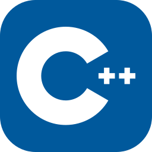

# Yahia Emad 🚀
### ⚡ Mobile Software Engineer | Flutter & Native Android Integrator ⚡

---

## Problem Solver

### 👤 About Me

- 📱 **Metrics-driven Mobile Software Engineer** with 4 years of hands-on experience specializing in high-performance applications.
- 🚀 Expert in optimizing mobile architectures using **Flutter, Dart, and Native Android (Kotlin & Java)**.
- 🧠 Deep expertise in **Clean Architecture, SOLID principles**, reactive state management via **Riverpod**, and thread-safe offline caching (**Hive DB**).
- ⚙️ Skilled in low-level OS hardware communication utilizing custom asynchronous **Kotlin Platform Channels** and performance tuning with **C++**.

---

### 🛠️ Tech Stack

  &nbsp;
  &nbsp;
  &nbsp;
  &nbsp;
  &nbsp;
  &nbsp;
  &nbsp;
  &nbsp;
  &nbsp;
  

> **Core Skills:** Riverpod | Hive DB | Shared Preferences | SOLID Principles | Kotlin Platform Channels | Material 3 Design | Google Gemini AI API

---

### 📁 Featured Production Projects

* **📱 PDF X — Advanced Document Reader & Explorer Platform**
  * Engineered a lightweight document visualization engine featuring a ~60MB binary footprint and sub-second cold startup time supporting PDF, Office, and text formats.
* **🏋️ ZABET — Multi-Utility Productivity & Gym Engine**
  * Architected an offline-first workflow companion combining background execution engines for workout metrics tracking and precise notification scheduling.
* **🔍 QR AI — Intelligent Scanner & Barcode Utility**
  * Built a responsive barcode and vector grid system, boosting scanning speed by writing explicit Kotlin wrappers around native camera APIs linked with Google Gemini AI.
* **🎬 NOVA MEDIA — Ultra-Low Footprint Multimedia Engine**
  * Created a low-RAM multimedia engine (~20MB storage) binding native Android MediaSession layers with a reactive Flutter UI for uninterrupted background playback.

---

### 📬 Contact Me

📞 **Phone:** [+201553427179](https://wa.me)  
✉️ **Email:** yahyaemad887@gmail.com  
💼 **LinkedIn:** [اضغط هنا لزيارة حسابي](https://linkedin.com)  

---

### 📊 GitHub Activity & Contribution Graph

### My Contribution Graph 🐉

